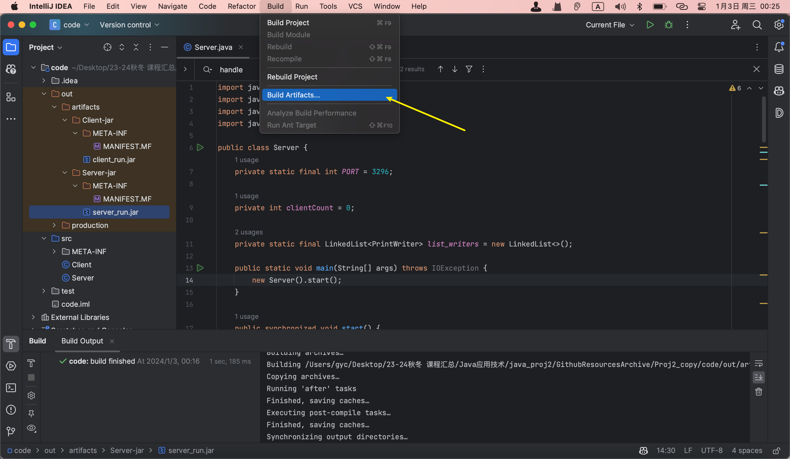
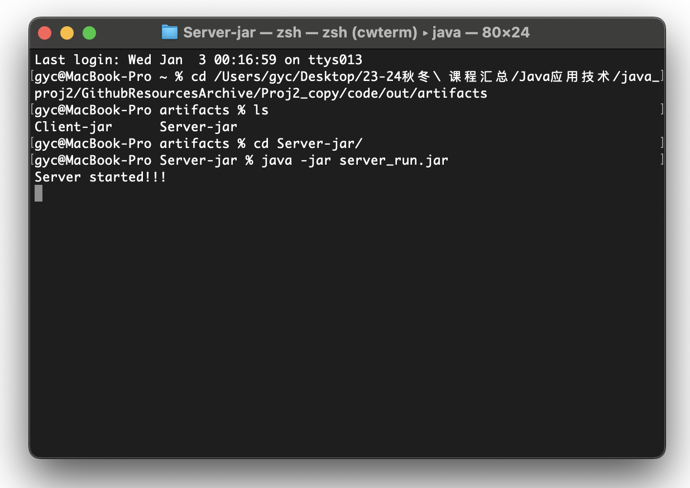
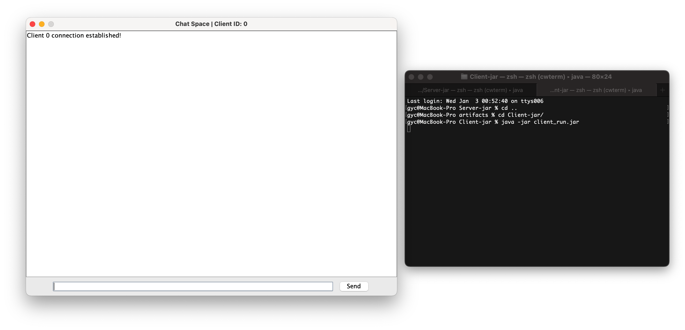
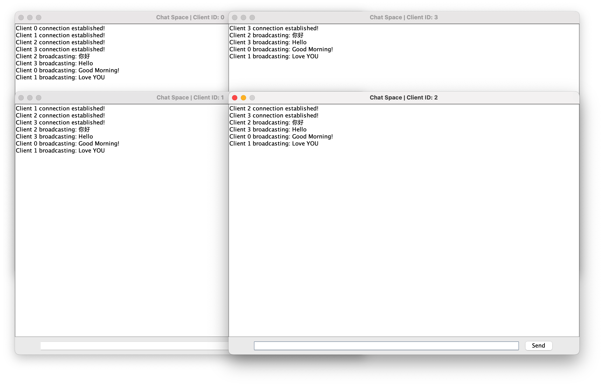
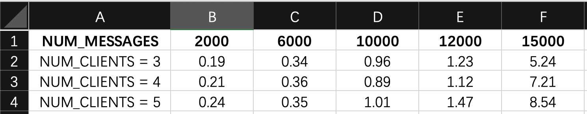

*ZHEJINAG UNIVERSITY, JAVA APPLICATION DESIGN*

# PROJECT: Java Chat Server

> Name: HuChenkai   ID: 3210103296

## 1 BASICS

### 1.1 Requirements

Implement a multi-client plain text chat server, which can accept the connection of multiple clients at the same time, and forward the text sent by any client to all clients (including the sender).

### 1.2 Envs

MacOS13.6.3 (22G436), Apple Silicon. 
IntelliJ IDEA2023.2.1. JDK19.

### 1.3 Quick Start

(1) run the `.jar` directly.

```
java -jar out/artifacts/Server-jar/server_run.jar
```

With server initialized, you can now run the `client_run.jar` repeatedly. Each run would generate a new client(auto numbered) connecting to the server via port 3296. Then you are free to test its functionalities using GUI popped up.

```
java -jar out/artifacts/Server-jar/client_run.jar
```

(2) complie from source code

Open the project using IntelliJ IDEA and click on "Build->Build artifacts...". You may need to set up JDK and adjust artifact parameters beforehand.



## 2 Code & Design

### 2.1 Server


The `Server` class is a network server for handling multiple client connections and messaging, based on Java's socket programming. It is designed to listen for client connection requests on a specified port and create a new thread for each connected client to handle message communication.

The following is a description of its design and key methodology:

1. **Macro-functionality:**
   
   - **Multi-Client Processing:** The server is capable of handling multiple client connections and message transfers. This is accomplished by creating a new thread for each connected client, thus supporting concurrent processing.
   - **Message broadcasting:** The server receives messages from any client and broadcasts them to all connected clients.
   
2. **Introduction to several key methods:**
   
   - **`start()`:** This is the main entry point for the server to run. It first sets up the server socket and enters an infinite loop that constantly listens for new client connection requests. Once it accepts a new connection, it calls the `handleNewClient()` method to handle that client.
   
   - **`setupServerSocket()`:** This method is responsible for creating and setting up a `ServerSocket` on the specified port. This is the point at which the server receives a new connection.

   - **`handleNewClient(Socket clientSocket)`:** This method is called whenever a new client connection is made. It creates a `ServerClient` object and starts a new thread for each new client.
   
   - **`broadcast(String msg)`:** This method is used to broadcast the received message to all connected clients. This is accomplished by traversing the `list_writers` linked list storing all client output streams and sending the message.
   
   - **`initializeStreams(int clientCount)`:** 
   
     ```java
             private void initializeStreams(int clientCount) {
                 try {
                     in = new BufferedReader(new InputStreamReader(socket.getInputStream()));
                     out = new PrintWriter(new BufferedWriter(new OutputStreamWriter(socket.getOutputStream())), true);
                     out.println(clientCount); 
                     out.flush();
                     list_writers.add(out);
                 } catch (IOException e) {
                     e.printStackTrace();
                 }
             }
     ```
   
     In the `initializeStreams` method, buffering is provided for input and output streams using the `BufferedReader` and `BufferedWriter` wrapper bases. This design reduces the need for frequent physical I/O operations and improves data processing efficiency by storing data in internal buffers. For input streams, this means that data can be read into memory in batches and then processed one at a time; for output streams, data is first accumulated in memory and then sent out at once, reducing the number of network communications.
   
     In particular, `PrintWriter`, used in output streams, has auto-refresh enabled in its constructor (`true` parameter). This ensures that data is sent from the buffer immediately after each call to `println` or a similar method, rather than waiting with a delay. This is particularly important to ensure timely data transfer, especially in network communication scenarios such as sending a client's unique identifier to each connected client.
   
3. **`ServerClient` class (important):**
   
   - An internal class that handles message communication for a single client. Each `ServerClient` instance runs in its own thread and is responsible for reading messages from its corresponding client and calling the `broadcast` method to broadcast them.
   - In the `initializeStreams` method, input and output streams are set up for each connected client, and the output streams are added to the `list_writers` linked list for subsequent message broadcasts.

### 2.2 Client


For BEST user experience, the client class involves constructing user-friendly graphical interface.

More specifically, the Client class is a Java Swing-based graphical user interface (GUI) application used to communicate with a socket-based server. It's capable of establishing a connection with the server, sending and receiving messages, and handling user interface interactions. It provides an input box for the user to enter messages through a graphical interface and the ability to display messages received from the server in a text area.

Key methods include `initFrame` for setting up the client's GUI, `initConnect` for initializing the connection to the server and starting a thread to receive messages, and `sendMessage` and `sendExitMessage` for sending messages and exit messages on close. 

> The `initConnect()` function requests the local server to establish a connection based on the PORT, and initializes the in/out pipeline.

These methods work together to ensure a responsive user interface and effective network communication, allowing the client to interact with the server and other clients in real time.

## 3 Test

### 3.1 Normal test

Start server:



Create clients:



Multiple clients at separate windows, sending and broadcasting messages at the same time:



### 3.2 Stress test

I've also designed a stress test with python. It is expected to give us a rough idea on how much chat-forwarding pressure the server can handle.


You can edit the testing parameters according to your needs.

```python
# 定义测试常量
NUM_MESSAGES = 15000
NUM_CLIENTS = 3
MESSAGE_MIN_LENGTH = 10
MESSAGE_MAX_LENGTH = 50
HOST = 'localhost'
PORT = 3296
```

To conduct the test, simply use the command below (assuming you have all the modules needed installed)

```
python test/StressTest.py
```

I recorded series of test datas in tables and drew them in graphs.




